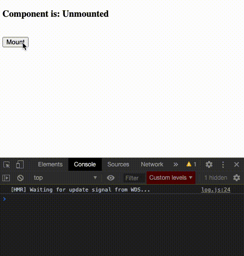

# react-useunmount

[](https://www.npmjs.com/package/react-useunmount) [](https://standardjs.com)

## The problem

When using a `useEffect` return function for handling component unmounting, state is not available.

## What this package does

This package is a super simple and minimal hook for storing an array of dependencies within a ref, making the data available on unmount - which is the effect function passed in as the first parameter.

It accepts a function as the first parameter, which gets called on component unmount, and a dependecy array as the second parameter which is stored and passed back to the unmount function. Fundamentally it:

- Creates a ref to store the required data in
- Initiates a useEffect for when the dependencies change, which updates the ref
- Initiates a useEffect for component unmount, which calls your unmount function with the dependency data passed back as the first argument

The gif below showcases the problem, and that our custom `useUnmount` works. If you look at the console on component unmount, our custom hook contains the active state unlike the standard `useEffect`.



## When might I need this?

If you have state data currently stored within context, state or a reducer and you need it available when the component unmounts.

If you don't need any of the above data on unmount, then you may only need a standard React `useEffect` return function:

```tsx
useEffect(() => {
  return () => {
    console.log("This will be called when the component unmounts");
  };
}, []);
```

## Install

```bash
npm install --save react-useunmount
```

or with yarn:

```bash
yarn add react-useunmount
```

The core code of this package is just 20 lines, so you may feel more comfortable copying the file `dist/index.js` into your own internal libraries. If you are using TypeScript, then you should copy `src/index.tsx` instead.

## Usage

```tsx
import * as React from "react";

import { useUnmount } from "react-useunmount";

const Example = () => {
  const [state, setState] = useState();

  useUnmount(
    // Destructure argument #1 into the same order as passed dependencies
    ([refState]) => {
      console.log("State now available via ref: ", refState);
    },
    [state]
  );

  return </>;
};
```

## Full Example

Want to see the full working example showcasing how this works, and why a standard useEffect isn't enough? Clone this repository and:

```bash
cd example && yarn start
```

## License

MIT © [WazzaJB](https://github.com/WazzaJB)
